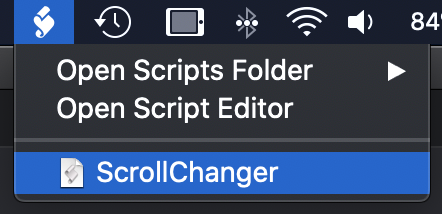

# ScrollChangerMac
If you are like me, you like to use the trackpad on your Mac with natural scrolling. But when you use a mouse, you like to use is in the reverse way. 
This simple script resides in your Menubar and with a simple click, you can just switch the scrolling for the device you like.

Installation instructions:

1. Download the ZIP file and double-click it to expand it.

2. If the ZIP file downloaded to your "Downloads" folder, use the following command:
    '''cp ~/Downloads/ScrollChangerMac-master/ScrollChanger.scpt ~/Library/Scripts/'''

3. Using spotlight (CMD-d), open the ScriptEditor app
    

4. Open the ScriptEditor settings
    
    
5. Select "Show Script menu in menu bar" 

    

6. Click on the ScriptEditor logo in the menu bar, and select ScrollChanger
    
    
7.  Accept every system preference prompt, and you are good to go!
    
